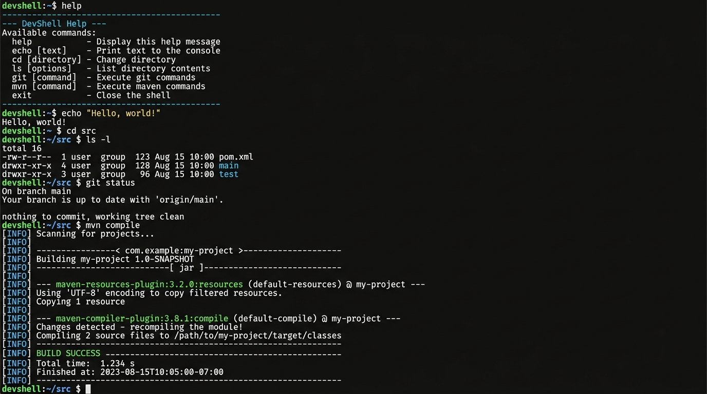

<div align="center">

# 🖥️ DevShell

**A custom terminal emulator and developer shell built from scratch in C++20 with FTXUI.**



[](https://en.cppreference.com/w/cpp/20)
[](https://cmake.org/)
[](https://github.com/ArthurSonzogni/FTXUI)
[](https://www.microsoft.com/windows)
[](LICENSE)

</div>

---

## Overview

DevShell is a **fully interactive terminal shell** rendered inside a TUI (Text User Interface), built entirely from scratch using modern C++20 and the [FTXUI](https://github.com/ArthurSonzogni/FTXUI) library. It is not a wrapper around an existing terminal — every layer, from input tokenization and command dispatch to asynchronous process execution and real-time output streaming, is hand-implemented.

The project demonstrates real systems-level engineering: polymorphic command dispatch via the **Command pattern**, an O(1) hash-map registry, a **multi-threaded streaming pipeline** with lock-free double buffering, and a custom TUI rendering loop with manual cursor control and mouse-wheel scrolling.

---

## Features

### 🔧 Core Shell
- **Built-in commands** — `help`, `exit`, `clear`, `echo`, `cd` — each implemented as a polymorphic `Command` subclass
- **System command execution** — any unrecognized input is forwarded to the OS via `_popen`, with stdout and stderr merged
- **Quoted string tokenizer** — handles double quotes, single quotes, escaped characters, and backslash-escaped spaces

### ⚡ Productivity
- **Tab auto-completion** — completes built-in command names (first word) and filesystem paths (arguments) from the current directory
- **Command history** — Up/Down arrow keys navigate through previously executed commands
- **Native `cd`** — directory changes via `std::filesystem` with proper error handling for missing/invalid paths

### 🎨 Performance & UX
- **Asynchronous streaming output** — external commands execute on a worker thread; output streams into the UI in real time without blocking input
- **Batched rendering** — lock-free double buffering flushes UI updates every 100 lines or 100ms, preventing event queue flooding
- **History cap** — terminal output is capped at 500 lines to keep scrolling and rendering fast during long-running commands
- **Custom block cursor** — hand-rolled `inverted` character rendering; no full-line highlight artifacts
- **Mouse-wheel scrolling** — scroll up through history, auto-snaps to bottom when you start typing
- **Bash-style prompt** — colored `devshell:~ $` prompt with clean, minimal aesthetics
- **Ctrl+C** — clean shutdown with worker thread cancellation and join

---

## Tech Stack

| Component         | Technology                                                                 |
| ----------------- | -------------------------------------------------------------------------- |
| Language          | C++20 (`std::filesystem`, structured bindings, `std::atomic`, `constexpr`) |
| UI Framework      | [FTXUI v5.0.0](https://github.com/ArthurSonzogni/FTXUI) (screen, dom, component) |
| Build System      | CMake 3.14+ with `FetchContent`                                           |
| Toolchain         | MinGW-w64 (GCC 13.2, bundled under `tools/`)                              |
| Threading         | `std::thread`, `std::atomic`, `screen.Post()` for thread-safe UI updates  |
| Process Execution | `_popen` / `_pclose` (Windows)                                            |

---

## Project Structure

```
DevShell/
├── CMakeLists.txt            # Build configuration, FetchContent for FTXUI
├── include/
│   ├── command.h             # Abstract Command base class + sentinel signals
│   ├── registry.h            # CommandRegistry — hash-map dispatch table
│   ├── builtins.h            # Concrete command classes (help, exit, cd, …)
│   ├── parser.h              # tokenize() — argv-style input splitting
│   └── shell.h               # Shell constants (version, title)
├── src/
│   ├── main.cpp              # TUI event loop, renderer, async streaming
│   ├── registry.cpp          # Registry implementation + _popen fallback
│   ├── builtins.cpp          # Built-in command implementations
│   └── parser.cpp            # Tokenizer with quote/escape handling
├── tools/
│   ├── cmake-3.31.6-…/       # Bundled CMake
│   └── mingw64/              # Bundled MinGW-w64 toolchain
└── build/                    # CMake build output (generated)
```

---

## Getting Started

### Prerequisites

- **CMake** 3.14 or later
- A **C++20-capable compiler** (GCC 13+, Clang 16+, or MSVC 2022)
- **Git** (for FetchContent to pull FTXUI)

> [!TIP]
> On Windows, the project ships a bundled MinGW-w64 toolchain and CMake under `tools/`. You can add them to your `PATH` to build without installing anything globally:
> ```powershell
> $env:PATH = ".\tools\cmake-3.31.6-windows-x86_64\bin;.\tools\mingw64\bin;$env:PATH"
> ```

### Build

```bash
# Configure (generates build system + fetches FTXUI)
cmake -B build

# Compile
cmake --build build --config Debug
```

### Run

```bash
./build/devshell.exe
```

---

## Usage

### Built-in Commands

| Command              | Description                                      |
| -------------------- | ------------------------------------------------ |
| `help`               | Lists all registered commands with descriptions  |
| `exit`               | Exits the shell cleanly                          |
| `clear`              | Clears the terminal output history               |
| `echo <args...>`     | Prints arguments to the terminal                 |
| `cd <directory>`     | Changes the current working directory             |

### System Commands

Any input that doesn't match a built-in is forwarded to the operating system as a subprocess. Output streams into the terminal in real time:

```
devshell:~ $ git status
On branch main
Your branch is up to date with 'origin/main'.

nothing to commit, working tree clean
devshell:~ $
```

### Keyboard Shortcuts

| Key           | Action                                        |
| ------------- | --------------------------------------------- |
| `Tab`         | Auto-complete command name or file path        |
| `↑` / `↓`    | Navigate command history                       |
| `Ctrl+C`     | Quit the shell                                 |
| `Mouse Wheel` | Scroll through terminal output history        |

---

## Architecture Notes

### Command Pattern + Registry

Every shell command implements the abstract [`Command`](include/command.h) interface (`execute`, `getName`, `getDescription`). Commands are stored as `std::unique_ptr<Command>` in an [`unordered_map`](include/registry.h) keyed by name, giving **O(1) average-case dispatch**. This design cleanly separates command logic from the TUI layer — commands return output strings (or sentinel signals like `__EXIT__`) rather than writing to the screen directly.

```
User Input → tokenize() → Registry::dispatch()
                              ├── Built-in? → Command::execute() → output string
                              └── External? → _popen() on worker thread → streamed output
```

### Async Streaming Pipeline

External commands run on a dedicated `std::thread` to keep the UI responsive. The worker reads subprocess output via `fgets` and accumulates lines into a **thread-local batch** (no shared locks). When the batch hits 100 lines or 100ms elapses, it is `std::move`'d into a `screen.Post()` lambda:

```
Worker Thread                         Main Thread (FTXUI)
─────────────                         ───────────────────
fgets() → local_batch.push_back()
        ...accumulate...
        batch full / timer fired
              │
              └─── screen.Post([batch = move(local_batch)] {
                       terminal_stream.insert(batch);  // no mutex needed
                       TrimStream();                    // cap at 500 lines
                   });
```

Since `screen.Post()` executes its lambda **on the main thread**, `terminal_stream` is only ever touched by one thread. This eliminates mutex contention entirely — a lock-free double-buffer design.

---

## Development Roadmap

| Phase | Milestone                           | Key Changes                                                    |
| ----- | ----------------------------------- | -------------------------------------------------------------- |
| 1–2   | Foundation                          | FTXUI TUI loop, Command registry, CMake build, Windows fixes   |
| 3     | System Command Execution            | `_popen` fallback for unknown commands, stderr merging          |
| 4     | Native `cd` Builtin                 | `std::filesystem::current_path()`, error handling               |
| 5     | Command History                     | Up/Down arrow navigation, history buffer                        |
| 6     | Tab Auto-Completion                 | `getCommandNames()` for builtins, `directory_iterator` for files|
| 7     | Continuous Stream UI                | Removed borders/chrome, bash-style prompt, `Element` stream     |
| 8     | Multithreaded Streaming             | Worker thread, `screen.Post()`, custom block cursor, scrolling  |
| 9     | Performance Optimization            | Lock-free double buffering, batched flushes, 500-line history cap|

---

## Known Limitations

- **Windows-only** — process execution uses `_popen` / `_pclose` (POSIX `popen` support is planned)
- **No piping or redirection** — `cmd1 | cmd2` and `> file` are not yet supported
- **Single-match Tab completion** — pressing Tab returns the first alphabetical match; cycling through multiple matches is not yet implemented
- **No job control** — background processes (`&`), `Ctrl+Z`, and `fg`/`bg` are not supported

---

## License

This project is licensed under the **MIT License** — see the [LICENSE](LICENSE) file for details.

---

## Author

**Arnav Chauhan**

[](https://github.com/Arnav-Chauhan-5)

---

<div align="center">

*Built with ☕ and modern C++ — because sometimes the best way to understand a terminal is to build one.*

</div>
